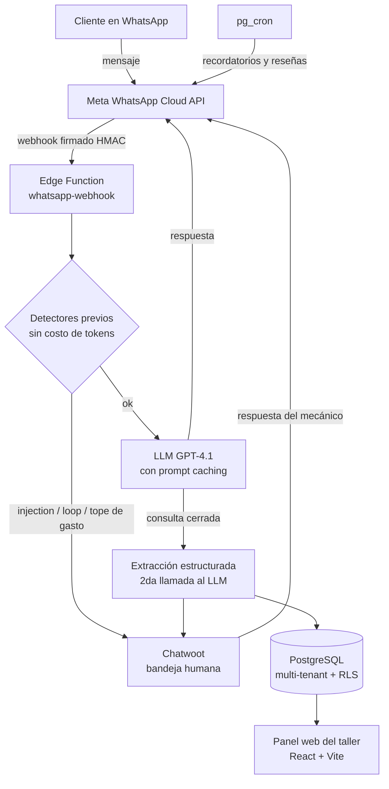

# Holy — asistente de WhatsApp con IA para talleres mecánicos

Plataforma multi-tenant que atiende por WhatsApp a los clientes de talleres mecánicos: toma la consulta, junta los datos del auto y del problema, propone turno y le entrega al mecánico la consulta ya estructurada en su panel. Cuando hace falta una persona, la conversación pasa a una bandeja de atención humana sin perder el historial.

Desarrollado por **Lisandro Torre** y **Joaquín Abbona** en [HOLY.systems](https://holysystems.com.ar), Mar del Plata, 2026.

> Este repositorio documenta la arquitectura y las decisiones de diseño del sistema, con fragmentos representativos. El código completo es privado y está disponible para revisión a pedido.

---

## El problema

Un taller chico recibe consultas por WhatsApp todo el día mientras el mecánico está con las manos en un motor. Las respuestas llegan tarde, los datos quedan desparramados en el chat y los turnos se pierden. Holy contesta al instante, pregunta lo que el mecánico necesita saber y deja cada consulta registrada como un pedido de trabajo.

## Arquitectura



**Stack:** TypeScript · React 18 + Vite · Tailwind + shadcn/ui · React Query · Supabase (PostgreSQL, Edge Functions en Deno, Row Level Security, pg_cron) · OpenAI GPT-4.1 · Chatwoot self-hosted · Meta WhatsApp Cloud API · Vercel

**Desarrollo asistido por IA:** Claude Code · Claude Cowork. Todo el sistema se construyó trabajando con agentes de IA: nosotros definimos la arquitectura, las decisiones y las pruebas con conversaciones reales; los agentes aceleraron la escritura del código.

## Decisiones técnicas

**API oficial de Meta, sin intermediarios.** Integración directa con WhatsApp Cloud API en vez de un BSP (Twilio, 360dialog) o un gateway no oficial. Los intermediarios cobran por número y por mes, y rompen la economía de un producto pensado para talleres chicos.

**Multi-tenant con aislamiento en tres capas.** Cada taller ve solo lo suyo: en la base, por Row Level Security filtrando por `workshop_id`; en la bandeja de atención, con una cuenta de Chatwoot por taller; y en las funciones del backend, con verificación de JWT y chequeo de tenant antes de cada operación.

**Agrupación de mensajes antes de responder.** La gente escribe por WhatsApp en ráfagas: "hola", "tengo un gol", "hace ruido al frenar". Responder mensaje por mensaje hacía que el bot sonara robótico y contestara a medias. Lo resolvimos después de probarlo con conversaciones reales: cada mensaje entrante espera 10 segundos y después intenta tomar un lock atómico sobre la conversación en PostgreSQL. Solo un proceso lo consigue; ese lee el historial completo, con todos los mensajes de la ráfaga, y hace una única llamada al modelo. Los demás terminan sin gastar tokens.

**Defensas antes del LLM, en código.** Antes de gastar un solo token, el webhook corre detectores propios: intentos de prompt injection, cancelaciones, bucles de conversación y spam de baja frecuencia que no llega a disparar el rate limit. El system prompt es la defensa secundaria, no la principal.

**Costo controlado por diseño.** Las variables de cada taller van al final del system prompt para maximizar el cache hit (75 % de descuento en tokens cacheados). Cada taller tiene un tope de gasto mensual en IA: al superarlo, el bot se apaga y todo pasa a atención humana. Costo variable estimado: unos USD 15 por taller por mes, entre IA y mensajes plantilla de Meta.

**Cierre de conversación con extracción estructurada.** Cuando el bot termina de juntar los datos, emite una señal de cierre. El sistema la quita del mensaje visible, hace una segunda llamada al modelo solo sobre los últimos mensajes para extraer marca, modelo, año, problema y turno preferido, crea el pedido en la base y transfiere la conversación a la bandeja humana con el historial como nota privada.

**Ciclo de vida completo, no solo un chat.** El pedido avanza por estados (pendiente → confirmado → en reparación → reparado → completado). Tareas programadas mandan el recordatorio del turno 24 h antes, avisan cuando el auto está listo y piden una reseña al día siguiente de terminado el trabajo.

**Seguridad.** Verificación HMAC de cada webhook de Meta; autenticación servidor a servidor entre funciones; tokens rotados después de una auditoría propia; datos personales enmascarados en los logs (teléfonos reducidos a sus últimos 4 dígitos); errores genéricos hacia el usuario final; CORS restrictivo y headers de seguridad HTTP.

## Fragmentos de código

**Agrupación de ráfagas + lock por conversación** (`whatsapp-webhook`)

```ts
// Esperar 10 segundos para agrupar mensajes rápidos del mismo cliente
await new Promise((r) => setTimeout(r, 10000));

// Lock atómico: solo un webhook procesa la conversación
const { data: lockResult } = await supabase.rpc("try_lock_for_ai", {
  p_conversation_id: conversationId,
});

if (!lockResult) {
  // Otro webhook ya tomó la conversación y va a leer este mensaje en el historial
  return jsonResponse(req, { ok: true });
}
```

**Verificación de la firma de Meta, fail-closed** (`whatsapp-webhook`)

```ts
const metaAppSecret = Deno.env.get("META_APP_SECRET");
if (!metaAppSecret) return jsonResponse(req, { error: "server_misconfigured" }, 500);

const rawBody = await req.text();
const sigHeader = req.headers.get("X-Hub-Signature-256") ?? "";
if (!sigHeader.startsWith("sha256=")) return jsonResponse(req, { error: "unauthorized" }, 401);

const key = await crypto.subtle.importKey(
  "raw", new TextEncoder().encode(metaAppSecret),
  { name: "HMAC", hash: "SHA-256" }, false, ["sign"],
);
const mac = await crypto.subtle.sign("HMAC", key, new TextEncoder().encode(rawBody));
const expectedSig = "sha256=" +
  Array.from(new Uint8Array(mac)).map((b) => b.toString(16).padStart(2, "0")).join("");

// Comparación en tiempo constante para no filtrar información por timing
if (!timingSafeEqual(expectedSig, sigHeader)) return jsonResponse(req, { error: "unauthorized" }, 401);
```

## Limitaciones conocidas y próximos pasos

**El taller tiene que dejar de usar WhatsApp en el celular.** Para conectar un número a la Cloud API, el dueño debe borrar su cuenta de WhatsApp del teléfono. Desde ahí atiende a sus clientes desde Chatwoot, una herramienta que funciona bien pero a la que el mecánico no está acostumbrado. La alternativa es WhatsApp Coexistence, que permite usar la app y la API sobre el mismo número. No la conocíamos al arrancar y, cuando la evaluamos, no servía para nuestro público: Meta exige que el negocio ya use la app de WhatsApp Business de forma constante y con antigüedad, y muchos talleres no cumplen eso. Es la primera mejora para un taller que ya la use.

**Alta manual de cada taller.** Hoy dar de alta un taller lleva varios pasos manuales entre Meta, Chatwoot y la base de datos. El paso siguiente está diseñado: Embedded Signup de Meta, para que el mecánico conecte su propio número desde el panel en pocos minutos y sea dueño de su cuenta de WhatsApp Business.

**Una sola cuenta de WhatsApp Business para todos los talleres.** Simplifica el arranque, pero sin la verificación del negocio Meta limita la cantidad de números. Embedded Signup también resuelve esto, porque cada taller pasa a tener su propia cuenta.

## Estado

En fase de prueba. El producto para talleres no se está comercializando; HOLY.systems hoy se dedica a software a medida y consultoría en IA.

## Autores

Diseñado y desarrollado en pareja, con desarrollo asistido por IA (Claude Code y Claude Cowork). Joaquín integra y versiona el código del repositorio.

- **Lisandro Torre** — co-diseño y co-desarrollo; producto, alta de talleres y comercialización · [github.com/torrelisandro](https://github.com/torrelisandro)
- **Joaquín Abbona** — co-diseño y co-desarrollo; integración y control de versiones · [github.com/joaquinabbona](https://github.com/joaquinabbona)
